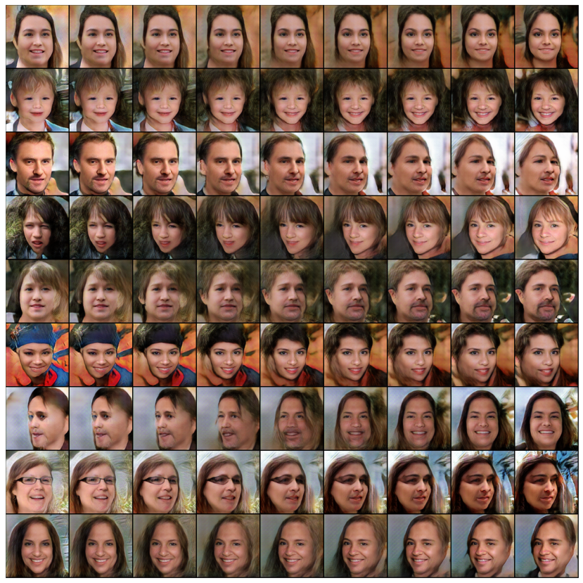

# DCGAN for face generation

## Description

The project is dedicated to the manual implementation and training of architecture based on DCGAN.

The task is to generate more or less photorealistic images.

## Stack

Loading, storing and processing data: pytorch dataset/dataloader (tensors), numpy (matrices)

Visualization: matplotlib, TSNE

Automation: torchvision, sklearn, albumentations

Models: pytorch - manually created discriminator and generator architectures

Individual solutions:

- selection of networks architectures and training hyperparameters
- implementation of Gaussian noise layers for neural networks
- gradient penalty
- work with labels: soft, noise, flip
- visualization of the learning process after each epoch, building the final comparative graphs
- quality metrics: Fréchet inception distance and Leave-one-out-1-NN classification

## Data

- [Flickr-Faces-HQ Dataset](https://github.com/NVlabs/ffhq-dataset)
- a blank ipynb provided by DL school MIPT was used in the work. The ipynb has been significantly redesigned to suit my needs.

## Conclusions

- implemented the classic DCGAN architecture for generating diverse images of people's faces in 128x128 resolution

- implemented additional tricks for training:
    - reversal of labels 0 and 1 during training
    - substitution of tags on real photos (passing them off as fakes) to protect against mod collapse
    - noisy labels and soft labels
    - image noise
    - Gaussian noise layers in discriminator and generator before convolution layers
    - buffer for generated images
    - added Gradient Penalty, which increases the loss when the "length" of the gradients differs from one
    
- manually experimentally selected training hyperparameters, in particular, the number of filters in the generator and discriminator and the batch size. All these parameters are critical for learning speed and network quality.

- implemented calculation and display of metrics:
    - receiving embeddings / latent vectors of images by a network pretrained on imagenet
    - Frechet inception distance
    - Leave-one-out-1-NN classification
    - t-SNE image features of real and generated images on a 2D plot

## Illustrations

The learning process by epochs:

Generated faces (each row is a smooth transition from one random latent vector to another)

